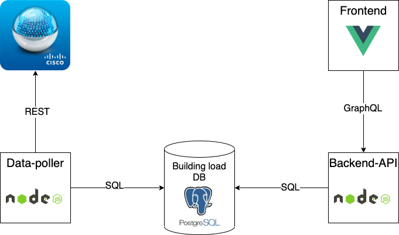
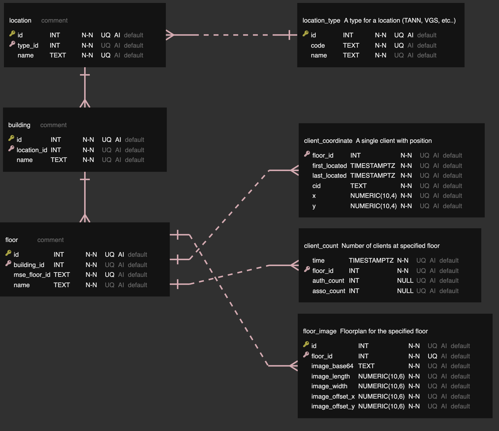

# Byggbelastning data poller
Data poller for the Byggbelastning project.

This will poll Prime and MSE for client count and locations, then insert it into a PostgresDB.

## Related repositories
- [byggbelastning-api](https://github.com/vtfk/byggbelastning-api)
- [byggbelastning-frontend](https://github.com/vtfk/byggbelastning-frontend)

## Usage
> Note: This project is still in development!
### Docker
> Note: There is currently no image on DockerHub
```sh
# Clone the repo, then cd into it
git clone https://github.com/vtfk/byggbelastning-data-poller
cd byggbelastning-data-poller/

# Run the compose-file to build the image and start a container
docker-compose -f docker/app/docker-compose.yml up -d # --build # Use the --build option to force-build on new version

# Read and follow the logs for the created container
docker logs -f byggbelastning-data-poller
```

### NodeJS
```sh
# Clone the repo, then cd into it
git clone https://github.com/vtfk/byggbelastning-data-poller
cd byggbelastning-data-poller/

# Install dependencies
npm install

# Rename dev.env to .env then edit it
mv dev.env .env

# Start the application
npm start
```

## Development
### Cloning
```sh
# Clone the repo
git clone https://github.com/vtfk/byggbelastning-data-poller
cd byggbelastning-data-poller/

# Install dependencies
npm i

# Rename template.env to .env then edit it
mv template.env .env
```
### Docker scripts
> Requires: `docker` and `docker-compose`
```sh
# Start the data-poller with:
npm run docker:start

# Stop data-poller container 
npm run docker:stop

# Start a dev DB with:
npm run docker:db:start

# Stop DB container 
npm run docker:db:stop

# Stop DB container, delete the DB directory, then start the DB container
npm run docker:db:clean
```
### Database scripts
```sh
# Creates all tables
npm run db:setup

# Drops specified tables, or all if '*' is used
# Prints all available tables if none are specified
npm run db:drop_tables -- {table_name} {another_table_name}

# Exports all columns from specified table
# Prints all available tables if none are specified
npm run db:export -- {table_name}
```

### Data Flow


### Database ER diagram
> Created using [ERD Editor (vuerd-vscode)](https://marketplace.visualstudio.com/items?itemName=dineug.vuerd-vscode) VSCode extension.



## API Docs
### Prime
 - {PRIME_URL}/webacs/api/v4/
 - https://www.cisco.com/c/en/us/support/cloud-systems-management/prime-infrastructure/products-programming-reference-guides-list.html

### MSE
 - https://developer.cisco.com/docs/mse-api-documentation/
 - https://www.cisco.com/c/en/us/td/docs/wireless/mse/8-0/MSE_REST_API/Guide/Cisco_MSE_REST_API_Guide.html

### Solarwinds
 - https://github.com/solarwinds/OrionSDK/wiki/REST
 - https://github.com/solarwinds/OrionSDK/releases/latest

## LICENSE
[MIT](LICENSE)